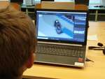

# 2021/2022

Kurz **Programování na Nuselské** bude probíhat od 23. září 2021
a volně navazuje na kurz **začátečníci**. Je určen pro děti druhých
až čtvrtých tříd libovolné základní školy s tím, že děti druhých
tříd musí mít absolvovaný kurz začátečníci, šikovní jedinci z
řad třetích či čtvrtých tříd mohou přijít i bez předchozího
vzdělání.

Cílem tohoto kurzu je pokračování v rozvoji systematického
myšlení, hlubší poznávání světa informační techniky
a osvojení si základů elektrotechniky.

Kurz bude probíhat 1x týdně, každý čtvrtek od 14:05 do 15:05
v počítačové učebně. V případě velkého zájmu je možné otevřít
další kurz od 15:10 do 16:10.

V kurzu budeme využívat robůtky [Cubetto](https://www.primotoys.com),
[Beebot](https://www.bee-bot.us/) i [Ozobot](https://ozobot.com/).
Později si představíme platformu [Micro:bit](https://microbit.org)
a s ní zabředneme trochu blíže k elektrotechnice. Kromě těchto
se budeme věnovat i práci na PC, kde se budeme učit programovat
pomocí vybraných kurzů na [code.org](https://www.code.org),
prostředí [scratch](https://scratch.mit.edu/) a dalších.
To vše proložíme tvůrčími aktivitami s papírem, kostkami a jinými
rekvizitami.

Cílem kurzu není vzdělat hotového programátora, ale rozvíjet logické
myšlení, algoritmizaci a jiné vlastnosti, které se dětem budou hodit
při studiu jakéhokoliv oboru.

Kurz bude organizován a veden [Lukášem Doktorem](../lectors/ldoktor)

## 1. hodina

* [www.code.org](https://www.code.org)
  * speedrun - kurz B 2019
    * všichni se dostali ke konci kapitoly 4
    * nejšikovnější začali kapitolu 5
* Prošli jsme si část z loňského [domácího úkolu](../2020_2021/pokrocili-2-13-domaci-ukol.pdf)
  * [Trachtenbergova rychlá matematika](../2020_2021/trachtenberg.pdf)
  * [Césarova šifra](https://cs.wikipedia.org/wiki/Caesarova_%C5%A1ifra)

## 2. hodina

* Seznámení s flashdiskem, připojení k systému, procházení souborů
* Perspektiva, ISO pohled, pohled shora - rozdíly, co jak vypadá, náčrtky na tabuli
  * OpenTTD - ISO pohled, lehčí na výpočet, vzdálené objekty stejně velké
  * Moderní hry - 3D, náročné na výpočet, podobné realitě
* Krita
  * Editor obrázků
  * Otevření souboru grafiky CZTR - autobusy
    * každý autobus je vykreslen na 8 obrázků, z každé strany
    * některé autobusy mají dodatečné 3 - 4 obrázky s otevřenými dveřmi
* Demonstrace upraveného autobusu ve hře OpenTTD

## 3. hodina

* Krita
  * Open-source polo-profesionální kreslicí software ke stažení zdarma <a href="https://krita.org/en/download/krita-desktop/">zde</a>
  * Ukázka nástrojů + jejich vlastnosti
  * Vrstvy
  * Malování stromu
* Beebot
  * Pohyb po mapě - vymysli příběh

## 4. hodina

* <a href="https://www.openttd.org/">OpenTTD</a>
  * Úprava českých grafik <a href="https://drive.google.com/drive/folders/1kb-IqbGQOF4nQj0s-E6xMc1hUdJ6efg-">CZTR_BUS_SET</a>
    * Autobus se skládá z 8 obrázků
    * Dle orientace se vybere požadovaný obrázek
    * Je možné přidat další obrázky pro nakládání/vykládání
    * Obrázek nemá faktický vztah k okolí (kolize, atributy, návaznost, ...), pouze se vykreslí na dané místo
  * Úprava atributů vozidel
    * ``*.nml`` soubor obsahuje mapování obrázků, zvuků a atributů vozidel
    * Otevřeme jej v textovém editoru, poté ``ctrl+f`` a najít požadované vozidlo
    * Upravíme vlastnosti - speed (rychlost), power (výkon), weight (váha), cargo_capacity (nosnost), ...
  * Kompilace nml => grf
    * trvala opravdu hodně dlouho (spouštěno z falshky)
  * Aktivace nových grafik v OpenTTD
  * Spuštění hry a demonstrace nových autobusů

## 5. hodina

* Programování na papíře
  * Naprogramuj robota "Šéfkuchař 3000" aby ti připravil sandwich
  * Počítač nepřemýšlí, pouze postupuje podle daného programu. Neudělá nic víc, nic míň.
  * Je potřeba přesně definovat co chceme vykonat
  * Čím méně řádků, tím méně chyb (Nejkratší plně validní kód dne: "Otevři balení chleba a vyndej 5 plátků chleba. END")

## 6. hodina

* <a href="https://www.lfs.net/downloads">Live For Speed</a>
  * Simulátor závodních aut
  * Zatáčení pomocí myši - velmi jemná a presná koordinace
  * Ukázka fyziky
    * Rozdíl mezi arkádou a simulátorem
    * Zobrazení simulovaných rovnic ovlivňujících pohyb auta - rozložení sil působících na jednotlivá kola
    * Rozdíl mezi povrchy (asfalt, bláto)
    * Úprava nastavení vozu (výška podvozku, tuhost pružin, převodovka, ...)
    * + samozřejmě závod o nejlepší čas
* Microbit
  * Připomenutí starého známého mikro-počítače; průzkum pod lupou

## 7. hodina

* Stavebnice Boffin
  * Úvod do elektroniky <a href="https://www.youtube.com/watch?v=mc979OhitAg">pěkné video zde</a>
  * Diskuze nad atomy, elektrony a světě kolem nás
  * Představení stavebnice Boffin a první zapojení

## 8. hodina

* Stavebnice Boffin
  * Vzhledem ke změně osazenstva opakování minulé hodiny
  * Sériové a paralelní zapojení
  * Použití mechanického voltmetru (včetně různých rozsahů)

## 9. hodina

* Lehký úvod do elektroniky
  * Vysvětlení pojmu "napětí" <a href="https://www.youtube.com/watch?v=w82aSjLuD_8">pěkné video zde</a>
  * <a href="https://cs.wikipedia.org/wiki/Tesl%C5%AFv_transform%C3%A1tor">Teslův transformátor</a>
    * malinký transformátor z Aliexpresu
    * sériové zapojení baterií (3x6x1.2V)
    * vytahování oblouku pomocí klíčů
    * přehrávání hudby pomocí jiskření
    * rozsvěcení úsporných žárovek, diod a tlumivek

## 10. hodina

* Mikuláš
  * Začátečníci připravovali a programovali Mikuláše, anděla a čerty, 50% pokročilých si to též chtělo vyzkoušet
  * Převleky a plán již vytvořen začátečníky, pokročilí pouze programovali Mikuláše (Cubetto) a anděly (Beebot)
  * Integrační test - Mikuláš je pomalejší, než anděl, nutno ošetřit (použití pauz)
* Boffin
  * Vysvětlení pojmu "proud" <a href="https://www.youtube.com/watch?v=kcL2_D33k3o">zde</a>
  * Stavba AM rádia a AM vysílače - bohužel něco selhalo; zapojení vypadalo správně, zvuky se ozývaly, ale rádio ani signál vysílače jsme nenaladili, příště se k tomu vrátíme.

## 11. hodina

* Boffin
  * Stavba AM rádia a AM vysílače - model z minulé hodiny byl moc potichý, využili jsme projekt 623, který je hlasitější
  * Hrátky s anténou
* RLE kódování
  * Run Length Encoding - kódování černobílého obrázku pomocí specifikace délky současné barvy
  * Pro ozvláštnění jsme využili "diamanty" z "5D diamond painting" a oboustrannou lepicí pásku
  * Grid pro čtvercové kostičky: [<a href="5d-diamond-grid.pdf">pdf</a>, <a href="5d-diamond-grid.dxf">dxf</a>]
  * Výběr několika obrázků: [<a href="rle.pdf">pdf</a>, <a href="rle.odt">odt</a>]

## 12. hodina

* Micro:bit
  * Propomenutí prostředí <a href="https://makecode.microbit.org/#">makecode</a>
  * Připojení periferií k microbitu pomocí V/V modulu (breakout board) a zapojení diody do nepájivého pole (breadboard)
  * Ovládání pinů pomocí ``Rozšířené->Piny->zapiš do pinu XXX logickou hodnotu YYY``

## 13. hodina

* Micro:bit
  * Zápis logické hodnoty vs. zápis hodnoty do pinu
  * Demonstrace PWM pomocí osciloskopu ze zvukové karty (WinScope)

## 14. hodina

* Micro:bit
  * Připojení a ovládání LED diod - had a semafor [zde](../assets/microbit)

## 15. hodina

* Micro:bit
  * Pokusili jsme se projít dokumentem k [výstupům](../assets/microbit/vstupy-pulls.pdf), ale moc se nám to nepodařilo
  * Podařilo se nám pouze zapojení, připojení na seriovou konzoli a pozorování různých hodnot ``přečteného čísla z pinu`` (0V - 3.2V => 0 - 1024)

## 16. hodina

* Micro:bit
  * soutěž v ukázkové minimalistické závodní hry Formule1 <a href="https://makecode.microbit.org/_LMg1dRitUM9v">zde</a>
* Kartonový domeček
  * Následujících několik hodin budeme vytvářet domeček z kartonu a následně jej osadíme zabezpečovacím zařízením
  * Model domečku jsme si dnes načrtli v 3D programu <a href="https://app.sketchup.com/app?hl=en">SketchUp</a>
    * Registrace pro osobní použití (pro menší modely) je zdarma
    * 2D nákres vytvoříme pomocí tužky (line); kliknu, myší určím směr (červená, zelená a modrá znamená směr v rámci základních os - pravé úhly); na klávesnici můžeme zadat vzdálenost (např 20 pro 20cm)
    * Pomocí nástroje vytažení (Push/Pull) můžeme vytáhnout plochu do prostoru (3D)
    * Prostředním tlačítkem myši (kolečko) mohu otáčet modelem, kolečkem mohu model oddálit/přiblížit

## 17. hodina

* Kartonový domeček
  * Výroba domečku dle plánu ve SketchUpu
  * Umístění senzorů a akčních členů

## 18. hodina

* Kartonový domeček
  * Dodělání stavby
  * Programování jednotlivých komponent (zvonek a zabezpečovačka odzkoušena, dveře čekají na příště)

## 19. hodina

* Kartonový domeček
  * Programování servo-motorků k ovládání garážových vrat
  * Programování dálkového ovládání k alarmu ([ukázkové programy zde](../assets/microbit))
  * Analyzování problému neustálého alarmu - příliš vysoká citlivost senzoru, nastaveno

## 20. hodina

* Kartonový domeček
  * Otestování funkčnosti
* Autíčka na ovládání
  * Sestavení autíček <a href="https://github.com/KitronikLtd/pxt-kitronik-move-motor">Kitronik :move motor</a> (poznámka: na fotografii výše umístily děti micro:bit do slotu obráceně)
  * Programování nejjednodušší varianty dálkového ovládání <a href="https://ldoktor.github.io/assets/microbit/#aut%C3%AD%C4%8Dko">ukázky zde</a>

## 21. hodina

* Výuka psaní všemi deseti
  * Využili jsme abandonware <a href="https://archive.org/details/msdos_Mario_Teaches_Typing_1992">Mario Teaches Typing</a>
  * V "Lessons" jsme zvolili ``Home Row Only`` (pouze prostřední řádek písmen)
  * Klikli jsme na obrázek ``1`` se sluníčkem, čímž jsme spustili výuku
  * Využili jsme klávesnice bez popisků (doma můžete zakrýt klávesnici kartonem)
  * Bez dívání nahmatáme ukazováčky výběžky kláves ``F`` a ``J``
  * Pozor na ``G`` a ``H``, které se píší také ukazováčky, ale je nutný posun prstů
  * Pozor na ``;``, který bývá na české klávesnici mezi klávesami ``Escape`` a ``Tabulator``
  * Snažit se o co nejméně chyb, následně zrychlovat a časem můžeme přidávat ostatní řady písmen.
  * Opakuji, nikdy nekoukat na klávesnici, od kontroly pozice jsou výběžky na klávesách ``F`` a ``J``
* Train Simulator
  * Jako odměna pro nejpřesnější pisatele byl úkol rozjet lokomotivu <a href="https://rw.jachyhm.cz/download/2017/09/cd-754/">ČD 750 (Brejlovec)</a> s realistickým ovládáním ve hře <a href="https://store.steampowered.com/app/24010/Train_Simulator_2022/">Train Simulator 2022</a>
  * Postup
    * Zapněte baterie (rozsvítí se kontrolka dobíjení)
    * Navolte světla dle typu vlaku
    * Odemkněte řízení vložením směrové páky
    * Přestavte směrovou páku do polohy D a stiskněte tlačítko START a držte jej po celou dobu mazání do doby, než se rozeběhne motor
    * Odemkněte brzdič BS 2
    * Povolte ruční brzdu po odklopení krytu
    * Zvolte požadovaný směr
    * Zařaďte požadovaný jízdní stupeň volantem jízdního kontrolér
    * Pozor na proudovou ochranu
    * Sledujte trať

## 22. hodina

* Autíčka na ovládání
  * Teoreticky jsme si prošli co je nutné implementovat na straně autíčka, vysílačky a jaký bude protokol mezi nimi
  * V rámci skupin děti pracovali na jedné či druhé komponentě
  * K inspiraci jsme použili <a href="https://ldoktor.github.io/assets/microbit/#aut%C3%AD%C4%8Dko">ukázky</a>

## 23. hodina

* Autíčka na ovládání <a href="https://ldoktor.github.io/assets/microbit/#aut%C3%AD%C4%8Dko">nápověda</a>
  * Pokračování v tvorbě, dnešní cíl je seznámit se se senzory (vzdálenost) a akčními členy (RGB diody, reproduktor)
  * Jedna skupina se pokoušela propojit starý Joystick jako ovládání
  * Příště budeme pokračovat

## 24. hodina

* Autíčka na ovládání <a href="https://ldoktor.github.io/assets/microbit/#aut%C3%AD%C4%8Dko">nápověda</a>
  * Všem se zdárně podařilo dokončit základní ovládání, pročež se uskutečnil závod sestávající se z ukázky "tuningu", funkčnosti bezpečnostních mechanizmů i jízdy zručnosti

## 25. hodina

* Nastavování domácího alarmu
  * Ukázka levného alarmu
  * Nastavní pomocí kódů (XX YY ZZ... #)
  * Zajímavá fakta o senzorech (PIR, magnet, ...)

## 26. hodina

* Vnitřek počítače
  * Co je počítač, monitor, ...
  * Co je mozkem počítače, pevný disk, operační paměť RAM, grafická karta, čipset, ...
  * Co jak na sebe navazuje
  * Rozebrání a složení počítače
  * Spuštění rozloženého počítače, ukázka zahřívání procesoru a tepelné ochrany

## 27. hodina

* Operační systémy
  * Co je to operační systém
  * Co udělá procesor po spuštění
    * Načte instrukce z dané adresy (BIOS)
    * Inicializuje zařízení a načte startovací sektor z nastaveného média (disk)
    * Pokračuje dle instrukcí operačního systému
  * Co se stane když není žádný operační systém instalován (HALT)
  * Praktická ukázka starých operačních systémů
    * Děti dostaly stejný úkol, nainstalovat si dnes již archaický operační systém a v něm vytvořit dokument s, alespoň jedním, obrázkem. Jak už to tak bývá, nový hardware zaprotestoval a nepovedlo se nám přeinstalovat ani jeden počítač a proto všichni používali pouze DOS.
    * Výtvory: [Max](pokrocili-2-12-max.gif), [Míša s Tomem](pokrocili-2-12-misa-tom.gif), [Tonda](pokrocili-2-12-tonda.gif)
    * Návody na instalaci:
      * DOS (1980 - 2006) návod [pdf](dos.pdf), [odt](dos.odt)
      * Windows 3.11 (1992 - 2001) návod [pdf](win311.pdf), [odt](win311.odt)
      * Windows 95 (1995 - 2000) návod [pdf](win95.pdf), [odt](win95.odt)

## 28. hodina

* [Human Resource Machine](https://tomorrowcorporation.com/humanresourcemachine)
  * Malinko jiný styl programování, blíže k Assembleru
  * návod ([pdf](../assets/hrm.pdf), [odt](../assets/hrm.odt)); diagram procesoru ([pdf](../assets/processor.pdf), [odt](../assets/processor.ods))

## 29. hodina

* Processor pod mikroskopem
  * Pro demonstraci zvětšení jsme využili lupu, vlasy a mravence
  * Následně jsme se podívali na processor z Micro:bitu a Arduina, osvětlení shora externě lampičkou + LED svítilnou, procesory předem opilované pilníkem (hrubý, dokud se nezaleskne křemíková vrstva)
  * Podívali jsme se i na <a href="https://i.stack.imgur.com/Jl16e.jpg">různé</a> <a href="https://cs.khanacademy.org/computing/informatika-pocitace-a-internet/x8887af37e7f1189a:pocitace/x8887af37e7f1189a:pocitacove-soucastky/a/central-processing-unit-cpu">obrázky</a> <a href="https://opengameart.org/sites/default/files/Motorola68040die-Farwestern-CCBYSA3.jpg">procesorů</a>
* [Human Resource Machine](https://tomorrowcorporation.com/humanresourcemachine)
  * pokračování
  * návod ([pdf](../assets/hrm.pdf), [odt](../assets/hrm.odt)); diagram procesoru ([pdf](../assets/processor.pdf), [odt](../assets/processor.ods))

## 30. hodina

* Dvojkové vs. desítkové soustavy čísel
  * Nejprve jsme si ukázali rozdíly a důvody, proč je dvojková soustava pro elektroniku výhodnější
  * Následně jsme převáděli čísla a udělali si tabulku s čísli 0-15 ve dvojkové soustavě
  * Nakonec jsme malovali obrázky zadané čísly
  * Vše a ještě něco navíc je popsáno v dokumentu [pdf](../assets/binary.pdf), [odt](../assets/binary.odt)

## 31. hodina

* Dvojkové vs. desítkové soustavy čísel
  * Počítadlo s 10 vs. 9 kuličkami
    * 100 vs 9999999999
    * sčítání
  * Reprezentace dvojkových hodnot
    * Kladná čísla
    * Záporná čísla
    * Čísla s plovoucí desetinou čárkou
    * Písmena
  * Detaily: [pdf](../assets/binary.pdf), [odt](../assets/binary.odt)
* Taneční podložka
  * <a href="https://www.stepmania.com/">StepMania</a>
  * Jelikož jde z pohledu počítače v podstatě o joystick, zkusili jsme i <a href="http://tuxracer.sourceforge.net/">Tux Racer</a>

  &#9664;
  
  &#9654;
  &times;

<link rel="stylesheet" href="/assets/gallery.css">

