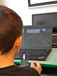
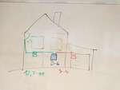

# 2021/2022

Kurz **Programování na Nuselské** bude probíhat od 23. září 2021
a je určen pro děti prvních[1](#footnote1) a druhých
tříd dětí z libovolných škol. Cílem těchto kurzů je rozvíjení
přirozené touhy dětí po poznávání okolního světa s důrazem na
techniku a rozvoj systematického myšlení.

Kurz bude probíhat 1x týdně každý čtvrtek od 13:00 do 14:00 v počítačové
učebně.

V kurzu budeme využívat robůtky [Cubetto](https://www.primotoys.com),
[Beebot](https://www.bee-bot.us/) i [Ozobot](https://ozobot.com/).
Zároveň se budeme věnovat i práci na PC pomocí open source aplikace
[GCompris](https://gcompris.net) a začneme kurzy z platformy
[code.org](https://[www.code.org](https://www.code.org)). Pro zpestření budou kurzy provázeny
tvůrčími aktivitami s papírem, kostkami a jinými rekvizitami.

Cílem kurzu není vzdělat hotového programátora, ale rozvíjet logické
myšlení, algoritmizaci a jiné vlastnosti, které se dětem budou hodit
při studiu jakéhokoliv oboru.

Kurz bude organizován a veden [Lukášem Doktorem](../../lectors/ldoktor.md)

## 1. hodina

* Seznámení s lektorem a ostatními spolužáky
* Beeboti
  * Hra - kdo dojede blíže ke spolužákovi
  * Pohyb vpřed a vzad
* Stránky [www.code.org](https://www.code.org)
  * Nastavení účtu
  * Přetahávání bločků

## 2. hodina

* Stránky [www.code.org](https://www.code.org)
  * Bludiště se Scratem
* Beeboti
  * Otáčení, pohyb do stran
  * Pohyb na mapě, souřadnicový systém (A1, C3, B6, ...)

## 3. hodina

* Stránky [www.code.org](https://www.code.org)
  * Bludiště se Scratem
  * Sbírání odpadu s BB-8
* Beeboti
  * Dostaň se na popsané místo (např. najdi úkryt před deštěm)

## 4. hodina

* Stránky [www.code.org](https://www.code.org)
  * Bludiště se Scratem
  * Sbírání odpadu s BB-8
* Beeboti
  * Poloha
    * Směrová růžice, poloha slunce, orientace na mapě
    * Poloha A1, B3, F6, ...
    * Rotace Sever (North), Jih (South), Východ (East), Západ (West)
    * Přesně definovaná poloha: A1E, B2W, C6N, ...
  * Opakované spuštění (A1E -> B2W -> A1E)

## 5. hodina

* Stránky [www.code.org](https://www.code.org)
  * Sbírání odpadu s BB-8
  * Kdo dokončil, směl si za odměnu zahrát nějaké hry z <a href="https://www.decko.cz">déčka</a>
* Beeboti
  * Zopakování určení přesné polohy
  * Úplný zápis programu do sešitu
  * Urči počáteční polohu, když znáš program a polohu cílovou
  * Soutěž mezi týmy, vyhrál tým Adidas

## 6. hodina

* Cubetto
  * Seznámení s "Kubíkem", robůtkem podobným Beebotům, který se programuje zasouváním bločků do báze
* Stránky [www.code.org](https://www.code.org)
  * Offline aktivita - "opakování"
  * Identifikuj repetitivní kód
  * Písnička "tlesk, tlesk, tlesk"
  * Demonstrace programu s opakováním

## 7. hodina

* Stránky [www.code.org](https://www.code.org)
  * Opakování se Scratem
* Stavebnice Boffin
  * Lehký úvod do elektroniky
  * Zapojení prvních schémat

## 8. hodina

* Stavebnice Boffin
  * Úprava obvodů (spoj vs. drát; délka spoje; přímé napojení)
  * Sériové a paralelní zapojení
  * Stavění zábavných projektů s vysvětlením

## 9. hodina

* Beeboti
  * měření vzdálenosti pomocí "měřidla"
  * "jízda ve skupině" (nutnost vkládat pauzy)
* Ozoboti
  * Lehké seznámení s Ozobotem
* Boffin
  * Různé projekty
  * Propojování obvodu skrz vodu, rukama, ...

## 10. hodina

* Mikulášská hodina
  * Paralelní vykonávání úkolů (každý žák je jeden processor); návaznosti mezi úlohami
  * Mikuláš - Cubetto, anděl - Beebot, 2x čert - ozoboti, vlastní podložka
  * Integrační test - Mikuláš je pomalejší, než anděl, řešením jsou pauzy
  * Hurá, povedlo se!

## 11. hodina

* Stránky [www.code.org](https://www.code.org)
  * BB8 a cykly se Scratem
* RLE kódování
  * Run Length Encoding - kódování černobílého obrázku pomocí specifikace délky současné barvy
  * Pro ozvláštnění jsme využili "diamanty" z "5D diamond painting" a oboustrannou lepicí pásku
  * Grid pro čtvercové kostičky: [<a href="5d-diamond-grid.pdf">pdf</a>, <a href="5d-diamond-grid.dxf">dxf</a>]
  * Výběr několika obrázků: [<a href="rle.pdf">pdf</a>, <a href="rle.odt">odt</a>]

## 12. hodina

* RLE kódování
  * Dokončení kódovaných obrázků
* Deskovka Ricochet Robots - hledání nejkratší cesty robotům bez brzd

## 13. hodina

* Stránky [www.code.org](https://www.code.org)
  * Cykly se Scratem, někteří se dostali až k cyklům s Laurelem

## 14. hodina

* Cubetto
  * Opakování pohybu po mapě formou soutěže (A3W => E4; ...)
  * Funkce - možnost definování sequence až 4 bločků a její vyvolání pomocí modrého bločku kdekoliv v programu (použitím modrého bločku uvnitř definice funkce vede k nekonečné smyčce)

## 15. hodina

* Stránky [www.code.org](https://www.code.org)
  * Dokončení cyklů se Scratem a vykly s Laurelem
* Cubetto&Beebot
  * Cubetto hlídal poklad, Beeboti se jej snažili ukořistit
  * Cílem bylo synchronizovat pohyb tak, aby nedošlo ke kontaktu s Cubettem ale ani s ostatníma včelkama

## 16. hodina

* Micro:bit
  * soutěž v ukázkové minimalistické závodní hry Formule1 <a href="https://makecode.microbit.org/_LMg1dRitUM9v">zde</a>
* <a href="https://www.umimeprogramovat.cz/sipkovana/">Šipkovaná</a>
  * Logická hra kde žáci navádějí Hobita domů

## 17. hodina

* Hra "Lodě" na čtverečkovaném papíře
  * Pravidla kdekoliv na internetu <a href="http://e-skola.zolta.cz/jak-se-hrajou-lode/">například zde</a>
  * Cílem je procvičovat souřadnicový systém, logiku a strategii
* <a href="https://www.umimeprogramovat.cz/sipkovana/">Šipkovaná</a>
  * Logická hra kde žáci navádějí hobita domů

## 18. hodina

* <a href="https://www.umimeprogramovat.cz/sipkovana/">Šipkovaná</a>
  * Logická hra kde žáci navádějí hobita domů
* <a href="http://aplikace.ucmeseprezit.cz/#/">http://aplikace.ucmeseprezit.cz/#/</a>
  * Ukázka zajímavě pojaté aplikace pro osvětu ohledně bezpečnosti na silnici nejen pro motorkáře

## 19. hodina

* Beeboti
  * Jako přípravu na další lekci v code.org jsme si pohráli se včelkama a fixy
  * Namaluj kolečko, čtverec, tabulku, hvězdičku
  * Změna hardware (fix vpředu, vzadu, vlevo, vpravo) či kódu (zatoč doleva, doprava)
  * Náhoda - programování náhodnými hody kostkou

## 20. hodina

* Stránky [www.code.org](https://www.code.org)
  * Umělec
* Bonus - vyzkoušení micro:bit autíčka

## 21. hodina

* Výuka psaní všemi deseti
  * Využili jsme abandonware <a href="https://archive.org/details/msdos_Mario_Teaches_Typing_1992">Mario Teaches Typing</a>
  * V "Lessons" jsme zvolili ``Home Row Only`` (pouze prostřední řádek písmen)
  * Klikli jsme na obrázek ``1`` se sluníčkem, čímž jsme spustili výuku
  * Využili jsme klávesnice bez popisků (doma můžete zakrýt klávesnici kartonem)
  * Bez dívání nahmatáme ukazováčky výběžky kláves ``F`` a ``J``
  * Pozor na ``G`` a ``H``, které se píší také ukazováčky, ale je nutný posun prstů
  * Pozor na ``;``, který bývá na české klávesnici mezi klávesami ``Escape`` a ``Tabulator``
  * Snažit se o co nejméně chyb, následně zrychlovat a časem můžeme přidávat ostatní řady písmen.
  * Opakuji, nikdy nekoukat na klávesnici, od kontroly pozice jsou výběžky na klávesách ``F`` a ``J``
* Train Simulator
  * Jako odměna pro nejpřesnější pisatele byl úkol rozjet lokomotivu <a href="https://rw.jachyhm.cz/download/2017/09/cd-754/">ČD 750 (Brejlovec)</a> s realistickým ovládáním ve hře <a href="https://store.steampowered.com/app/24010/Train_Simulator_2022/">Train Simulator 2022</a>
  * Postup
    * Zapněte baterie (rozsvítí se kontrolka dobíjení)
    * Navolte světla dle typu vlaku
    * Odemkněte řízení vložením směrové páky
    * Přestavte směrovou páku do polohy D a stiskněte tlačítko START a držte jej po celou dobu mazání do doby, než se rozeběhne motor
    * Odemkněte brzdič BS 2
    * Povolte ruční brzdu po odklopení krytu
    * Zvolte požadovaný směr
    * Zařaďte požadovaný jízdní stupeň volantem jízdního kontrolér
    * Pozor na proudovou ochranu
    * Sledujte trať

## 22. hodina

* Výuka psaní všemi deseti
  * Zopakovali jsme si princip (rozdělení kláves dle prst§)
  * Zkusili jsme <a href="https://www.umimeinformatiku.cz/psani-vsemi-deseti">https://www.umimeinformatiku.cz/psani-vsemi-deseti</a>
  * Většinu to moc nebavilo, proto jsme se přesunuli zpět na <a href="https://archive.org/details/msdos_Mario_Teaches_Typing_1992">Mario Teaches Typing</a>
  * Tímto uzavíráme tuto oblast, děti mají povědomí o tom, jak případně pokračovat doma, pokud budou chtít
* Train Simulator
  * Zbytek dětí si vyzkoušelo postupovat dle návodu a rozjet lokomotivu (a jeden šťastný výherce i včas zastavil před překážkou)
  * V rámci zážitku jsme si ještě ukázali, jak vše vypadá v noci a co vše (ne)vidí strojvůdce

## 23. hodina

* Události - na tabuli jsme si udělali tlačítka, nadefinovali akce (výskok, úkrok, ...) a společně vyzkoušeli
* Pexeso - ve dvojicích, jeden ovládá tleskáním s ukázáním směru druhého, který se pohybuje po obrázkách pexesa
* Stránky [www.code.org](https://www.code.org)
  * Na měsíc s událostmi - plnění úkolů s událostmi

## 24. hodina

* Stránky [www.code.org](https://www.code.org)
  * Na měsíc s událostmi, kdo dokončil, mohl se přesunout na bonusovou aktivitu
* Bonus - ukázka propojení microbitu s počítačem a zároveň zkouška ovládání myši pomocí mini-joysticku
  * <a href="https://www.minetest.net/">Minetest</a> (opensource napodobenina Minecraftu zdarma, doporučuji pro rozvoj fantazie a prostorové představivosti)
  * Euro Truck Simulator 2 - děti doručili zdárně náklad i přes 12 rychlostní manuální převodovku (bez couvání)

## 25. hodina

* Nastavování domácího alarmu
  * Ukázka levného alarmu
  * Nastavní pomocí kódů (XX YY ZZ... #)
  * Zajímavá fakta o senzorech (PIR, magnet, ...)

## 26. hodina

* Vnitřek počítače
  * Co je počítač, monitor, ...
  * Co je mozkem počítače, pevný disk, operační paměť RAM, grafická karta, čipset, ...
  * Co jak na sebe navazuje
  * Rozebrání a složení počítače
  * Spuštění rozloženého počítače, ukázka zahřívání procesoru a tepelné ochrany

## 27. hodina

* Operační systémy
  * Co je to operační systém
  * Co udělá procesor po spuštění
  * Praktická ukázka starých operačních systémů
    * Děti dostaly stejný úkol, vytvořit dokument s alespoň jedním obrázkem na počítači s nainstalovaným starým operačním systémem. Jejich výsledky si můžete prohlédnout na odkazech u jednotlivých systémů.
    * DOS (1980 - 2006) návod [pdf](dos.pdf), [odt](dos.odt), [výtvor Zdendy](zacatecnici-2-12-zdenda.gif), [výtvor Nikiho](zacatecnici-2-12-niki.gif), textový dokument neexportován
	* Windows 3.11 (1992 - 2001) návod [pdf](win311.pdf), [odt](win311.odt), výtvor Honzíka [pdf](zacatecnici-2-12-honzik.pdf), [wri](zacatecnici-2-12-honzik.wri)
	* Windows 95 (1995 - 2000) návod [pdf](win95.pdf), [odt](win95.odt), výtvor Matýska [pdf](zacatecnici-2-12-maty.pdf), [doc](zacatecnici-2-12-maty.doc)

## 28. hodina

* [Human Resource Machine](https://tomorrowcorporation.com/humanresourcemachine)
  * Malinko jiný styl programování, blíže k Assembleru
  * návod ([pdf](../assets/hrm.pdf), [odt](../assets/hrm.odt)); diagram procesoru ([pdf](../assets/processor.pdf), [odt](../assets/processor.ods))

## 29. hodina

* Processor pod mikroskopem
  * Pro demonstraci zvětšení jsme využili lupu, vlasy a mravence
  * Následně jsme se podívali na processor z Micro:bitu a Arduina, osvětlení shora externě lampičkou + LED svítilnou, procesory předem opilované pilníkem (hrubý, dokud se nezaleskne křemíková vrstva)
* [Human Resource Machine](https://tomorrowcorporation.com/humanresourcemachine)
  * pokračování
  * návod ([pdf](../assets/hrm.pdf), [odt](../assets/hrm.odt)); diagram procesoru ([pdf](../assets/processor.pdf), [odt](../assets/processor.ods))

## 30. hodina

* Kvůli <a href="https://www.root.cz/zpravicky/vypadek-v-datacentru-master-internet-vyradil-spoustu-sluzeb-vcetne-root-cz/">výpadku proudu</a> jsme zlehka načali téma dvojkové soustavy
  * Nejprve jsme si ukázali rozdíly a důvody, proč je dvojková soustava pro elektroniku výhodnější
  * Následně jsme převáděli čísla a udělali si tabulku s čísli 0-15 ve dvojkové soustavě
  * Nakonec jsme malovali obrázky zadané čísly
  * Vše a ještě něco navíc je popsáno v dokumentu [pdf](../assets/binary.pdf), [odt](../assets/binary.odt)

## 31. hodina

* <a href="https://robomise.cz/">RoboMise</a>
  * Logická programovací hra s cílem dostat raketu skrze asteroidy do bezpečí.
* Taneční podložka
  * <a href="https://www.stepmania.com/">StepMania</a>
  * Jelikož jde z pohledu počítače v podstatě o joystick, zkusili jsme i <a href="http://tuxracer.sourceforge.net/">Tux Racer</a>

* * * * * * * * *

<a name="footnote1">1</a>: Dle psychologa [Jeana Piageta](https://cs.wikipedia.org/wiki/Jean\_Piaget)
nelze děti mladší 6-7 let učit systematické vědy, neboť se nacházejí
ve stádiu `názorového (prelogického) myšlení`, které ještě plně
nerespektuje logiku. Ukázka experimentu je ke shlédnutí například
[zde](https://www.youtube.com/watch?v=tQLpysTbFso) (doporučuji vyzkoušet),
výuka mateřského jazyku začíná také daleko dříve, než je děťátko schopné
jej pochopit a přirozeně se vytváří návyky a spoje, jež jednou vedou v
schopnost mluvit a myslet v daném jazyce. Bilingvální výchova pak vede
ke schopnosti mluvit a myslet ve více jazycích. Proto věřím, že správným
přístupem lze začít daleko dříve a sám využívám logické hry, roboty i
počítač ke hře a vlastně i výuce svých dětí takřka od narození.

